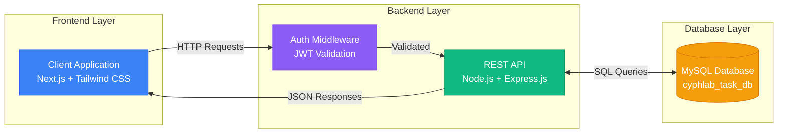
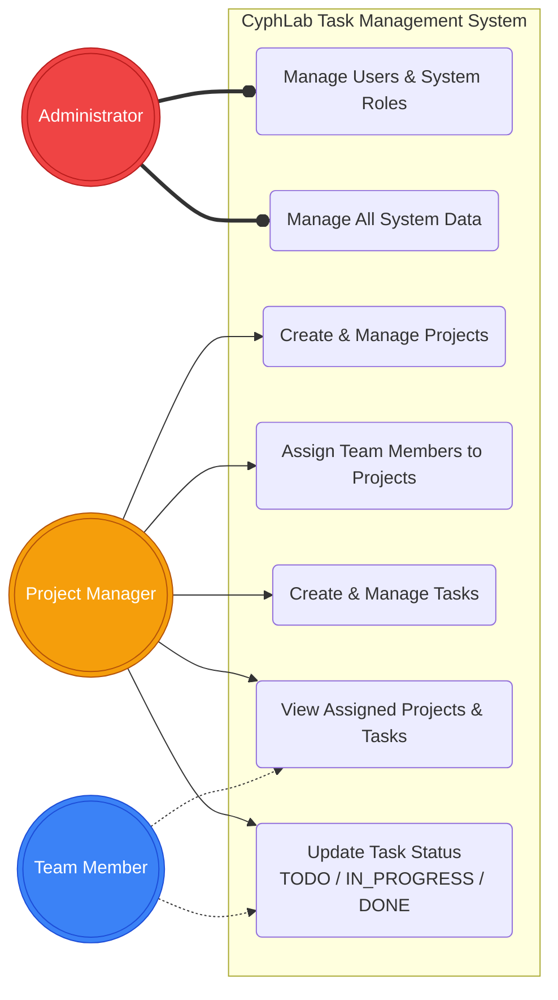
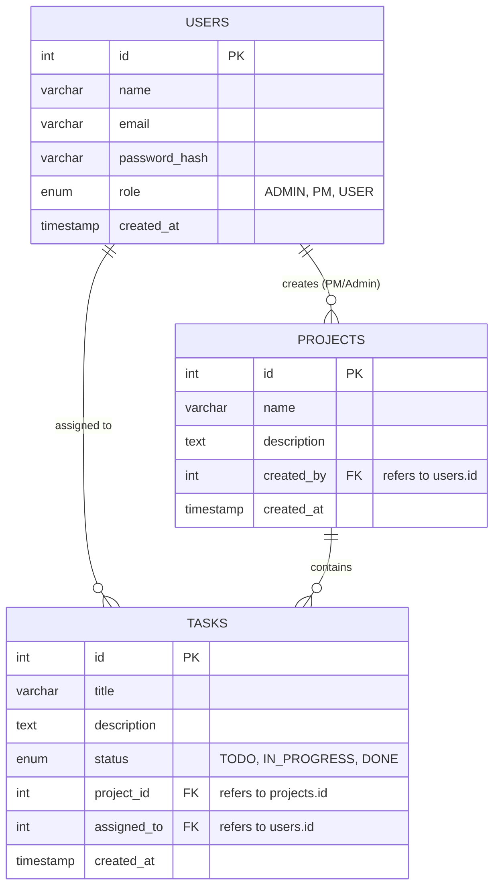

# CyphLab Task Management System

A full-stack, enterprise-grade project and team task management application built for the CyphLab Software Engineering Internship assignment. This platform provides a centralized workspace for teams to track initiatives, manage issues, and collaborate efficiently using an interactive Kanban-style board.

## 🚀 Core Features
* **Role-Based Access Control (RBAC):** Distinct privileges for Administrator, Project Manager (PM), and Team Member (USER) roles.
* **Project Management:** Create and manage distinct projects and assign team members.
* **Kanban Board:** Interactive 3-column task board (To Do, In Progress, Done) for visualizing workflows.
* **Modern SaaS UI/UX:** Responsive, user-friendly interface with glassmorphism design, mesh gradients, and smooth animations using Tailwind CSS.
* **Secure Authentication:** Stateless authentication and authorization via JSON Web Tokens (JWT) and bcrypt password hashing.

## 💻 Tech Stack
* **Frontend:** Next.js (App Router), React, Tailwind CSS, Lucide Icons, Axios.
* **Backend:** Node.js, Express.js.
* **Database:** MySQL.
* **Version Control:** Git & GitHub.

## ⚙️ Prerequisites
Before running this project, ensure you have the following installed:
* Node.js (v16 or higher)
* MySQL Server (Running locally or remotely)
* A database named `cyphlab_task_db` created in your MySQL server.

## 🛠️ Setup Instructions

### 1. Backend Setup
1. Navigate to the backend directory:
   ```bash
   cd backend
   ```
2. Install required dependencies:
   ```bash
   npm install
   ```
3. Create a `.env` file in the root of the `backend` folder (refer to the `.env.example` file) and add your database credentials:
   ```env
   PORT=5000
   DB_HOST=localhost
   DB_USER=root
   DB_PASSWORD=your_mysql_password_here
   DB_NAME=cyphlab_task_db
   JWT_SECRET=your_super_secret_jwt_key_here
   ```
4. Start the backend server (Tables will be auto-generated if they don't exist):
   ```bash
   npm start
   ```
   *The backend should now be running on `http://localhost:5000`*

### 2. Frontend Setup
1. Open a new terminal and navigate to the frontend directory:
   ```bash
   cd frontend
   ```
2. Install required dependencies:
   ```bash
   npm install
   ```
3. Start the Next.js development server:
   ```bash
   npm run dev
   ```
4. Open your browser and navigate to: **[http://localhost:3000](http://localhost:3000)**

---

## 🤖 AI Tools Statement
During the development of this project, **Google Gemini AI** was utilized as a coding and architectural assistant. The AI assisted in structuring the RESTful backend API endpoints in Node.js, designing the responsive Next.js frontend components with Tailwind CSS (including the UI animations and Kanban board), implementing secure authentication flows, and generating comprehensive system documentation (such as Mermaid.js diagrams).

## 🔄 CI/CD Workflow Explanation
For this project, a basic Continuous Integration/Continuous Deployment (CI/CD) pipeline can be implemented using GitHub Actions. The workflow would be configured to trigger upon every push or pull request to the `main` branch. 
* **Linting & Validation:** It runs `npm run lint` to enforce code quality and syntax standards.
* **Build Testing:** It executes `npm run build` on the Next.js application to ensure the frontend compiles successfully without errors, validating that the application is production-ready before any deployment.

---

## 📊 System Diagrams

### 1. System Architecture Diagram
Illustrates the high-level communication between the client, API, and database layers.




### 2. Use Case Diagram
Maps the system functionalities accessible by different user roles (Admin, Project Manager, Team Member).



### 3. Entity Relationship Diagram (ERD)
Defines the database schema, tables, relationships, and constraints.


